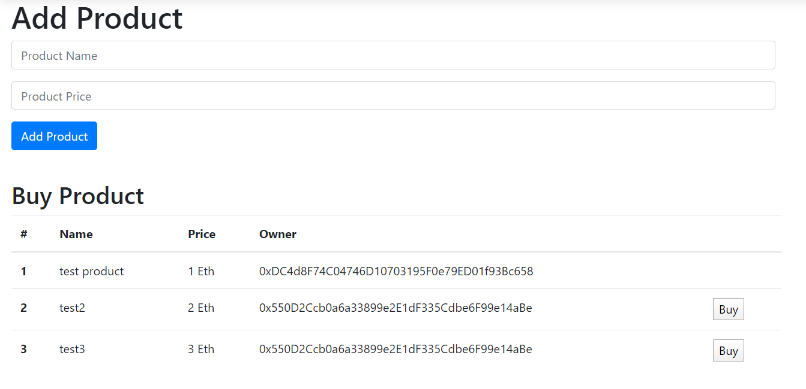
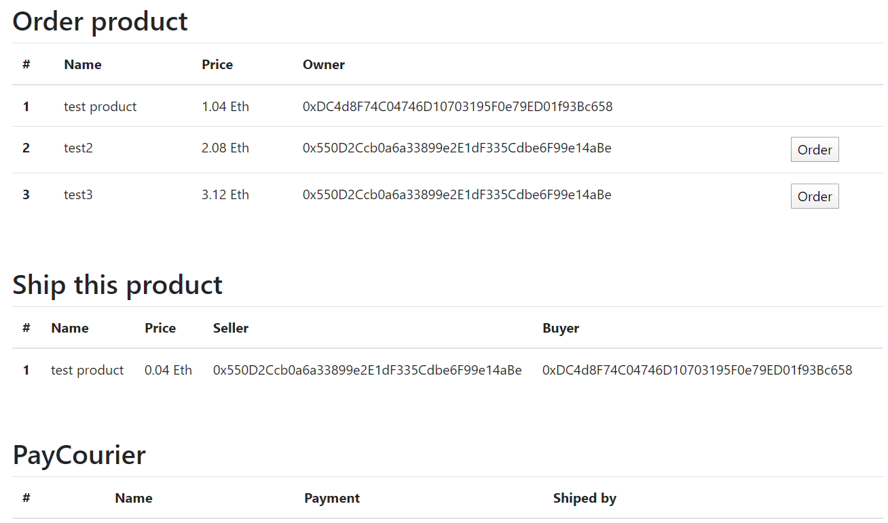
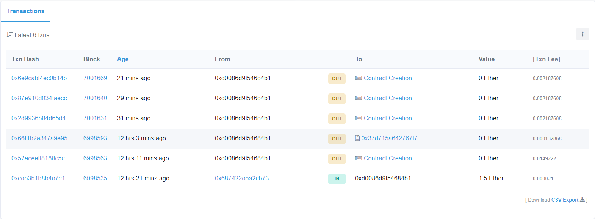

# smart-contract

## My Marketplace

įgyvendinti 2 produktų nusipikimo budai:
Pirmas: paprastas produkto pirkimas - kažkoks pardavėjas įkelia naują produktą, nustato jo pavadinimą ir kainą (Ether).
Tada kažkoks pirkėjas sumoka už produktą ir produkto savininkas pasikeičia iš pardavėjo į pirkėją.

Antras: produktų užsisakymas ir siuntimas - kaip ir pirmame metode pardavėjas įkelia naują produktą.
Tada pirkėjas užsisako produktą ir sumoka ir uz produktą ir už siuntimą.
Kurjeris tada išsiunčia produktą, o pardavėjas jam sumoka:

Buvo atliktas testavimas lokalioje Etherium aplinkoje ir Ropsten testnet aplinkoje:

